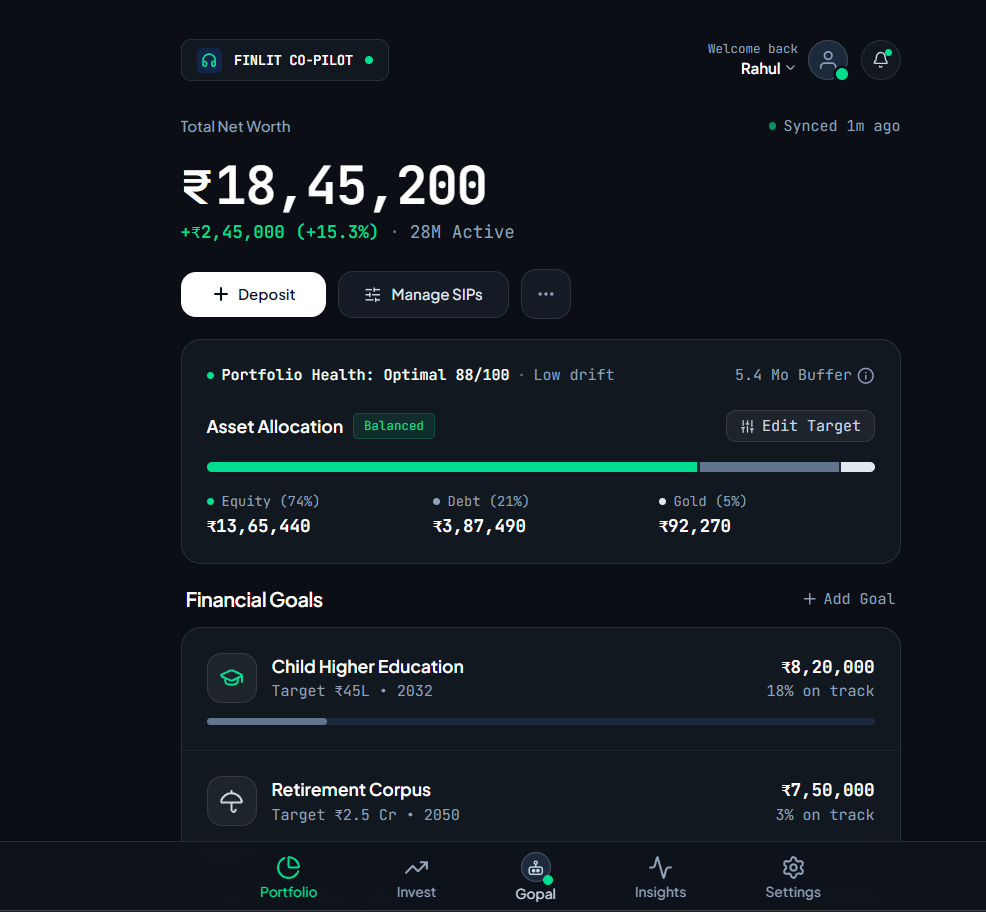
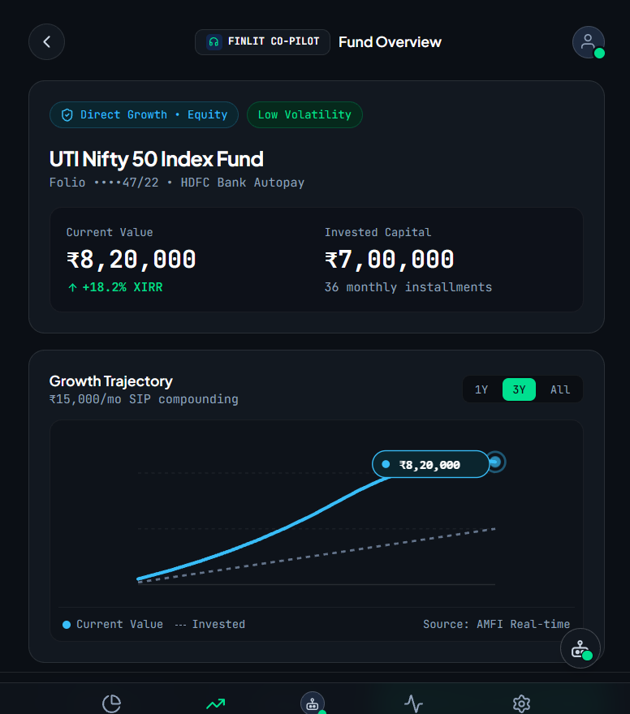
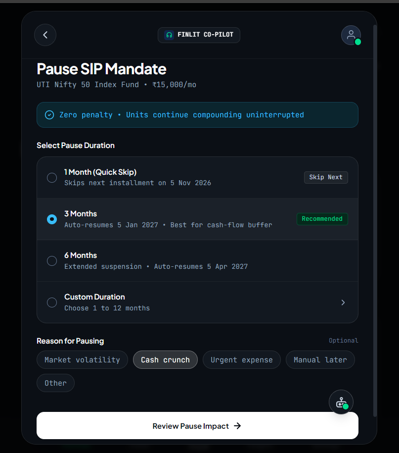
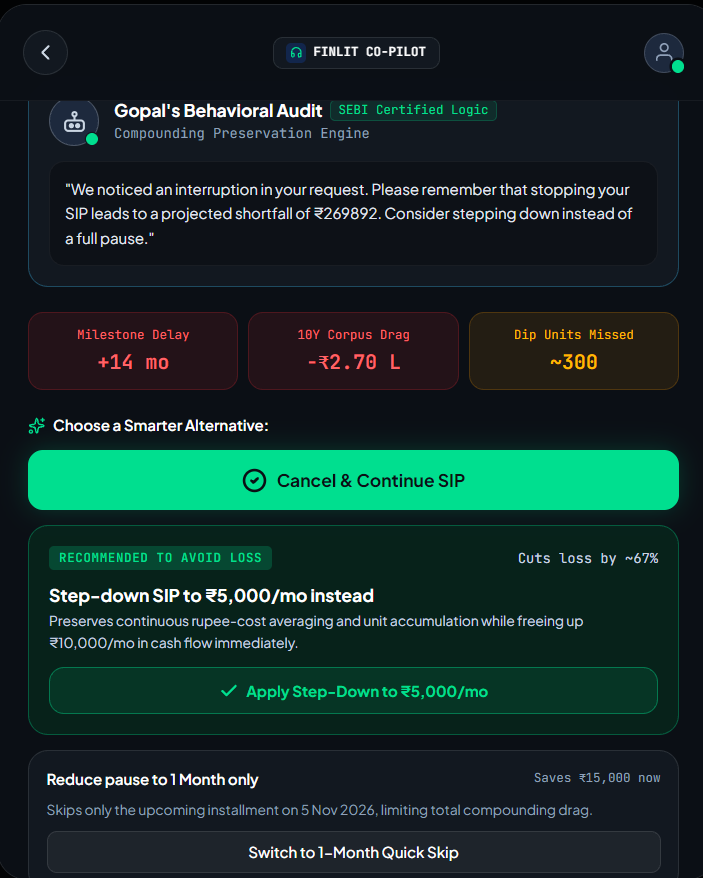
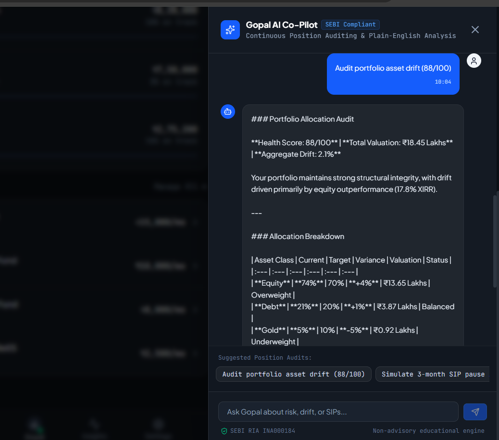

<div align="center">

---

## ⚠️ The Problem: The Cost of Emotional Investing

Retail investors don't always need more financial information — they need the **right friction at the right moment**.

During market corrections (e.g., a 10% market crash), investors can make emotionally driven decisions such as:

- ⏸️ Pausing a SIP out of panic.
- 📉 Withdrawing funds during a temporary downturn.
- 🔄 Deviating from a long-term investment plan.
- 😰 Prioritizing short-term emotional comfort over long-term compounding.

Traditional investment platforms are optimized for transaction speed. When an investor decides to pause or exit an investment, the action can often be completed with minimal contextual reflection.

A single emotional decision can therefore disrupt a long-term wealth-building strategy.

### The Core Behavioral Problem

```text
Market Volatility
       ↓
Emotional Reaction
       ↓
"Pause SIP" / "Withdraw"
       ↓
Long-Term Opportunity Potentially Lost
       ↓
Compounding Impact
```

---

## 💡 Our Solution: The Behavioral Friction Engine

**FinLit Co-Pilot** intercepts potentially destructive financial actions and introduces a data-driven, AI-powered decision checkpoint.

Instead of simply blocking the action, the platform explains its **potential mathematical and behavioral consequences** before the investor confirms the decision.

### 🛑 The Intervention Flow

```text
Market drops by 10%
       ↓
Investor attempts to "Pause SIP" or "Withdraw"
       ↓
🛑 FinLit Co-Pilot intercepts the action
       ↓
Behavioral Audit is triggered
       ↓
Real-time financial impact is calculated
       ↓
AI explains potential compounding drag & missed units
       ↓
Actionable alternatives are presented
       ↓
Investor makes an informed decision
```

### Example Alternatives

- 📉 **Step-down SIP** — reduce the contribution instead of stopping completely.
- ⏱️ **1-Month Quick Skip** — provide a temporary option when cash flow is the actual problem.
- ✅ **Cancel & Continue SIP** — return to the original long-term investment plan.

> **The objective is not to force an investor to continue investing — it is to make the investor think before they act.**

---

## ✨ Key Features & Product Showcase

### 1. 📊 Intelligent Investment Dashboard

A comprehensive view of the investor's net worth, portfolio health score, and active financial goals.



---

### 2. 📈 Fund Growth Overview

A focused view of individual mutual fund trajectories, comparing invested capital against current valuations through dynamic charting.



---

### 3. ⏸️ SIP Pause Interception Flow

The crucial interception point. Before a mandate is paused, the investor selects a duration and the behavioral reason behind the action, such as market volatility or a cash-flow crunch.



---

### 4. 🤖 Gopal's Behavioral AI Audit

#### ⭐ The Core Engine

**Gopal** is the behavioral intelligence layer of FinLit Co-Pilot.

The AI dynamically analyzes the intervention context and surfaces metrics such as:

- 📉 **10Y Corpus Drag**
- 📊 **Investment Drift**
- 💰 **Potential Compounded Shortfall**
- 📦 **Dip Units Missed**
- ⏳ **Long-Term Opportunity Cost**

The interface prominently presents:

> **Cancel & Continue SIP**

alongside a practical **Step-down SIP** alternative, while keeping the destructive pause action visually low-emphasis.



---

### 5. 💬 SEBI-Aligned AI Chat

Gopal also provides a conversational financial-literacy interface for contextual explanations and decision support.

The assistant can explain concepts such as:

- LTCG / STCG
- Exit loads
- Portfolio drift
- Investment behavior
- Potential consequences of withdrawal decisions



> **Note:** FinLit Co-Pilot is designed as an educational and decision-support prototype, not as a substitute for regulated investment advice.

---

## 🧠 Architecture & Explainable AI

Our backend is powered by **Google Gemini 3.8 Flash** through **server-side Next.js API routes**.

To improve reliability and predictable rendering, FinLit Co-Pilot separates deterministic financial calculations from AI-generated explanations.

### 🔢 1. Strict Payload Binding

The financial calculation layer computes the exact mathematical impact first, including:

```text
compoundedShortfall
unitsMissed
drift
```

These values are passed to the AI layer as structured contextual inputs, keeping the model focused on interpretation and explanation rather than acting as the primary calculator.

### 🧾 2. Structured AI Output

The Gemini response is constrained using a strict **JSON response schema** to guarantee predictable, machine-readable output for the frontend.

```text
Investor Context
      ↓
Financial Calculation Layer
      ↓
Structured Gemini Payload
      ↓
Gemini 3.8 Flash
      ↓
Behavioral Interpretation
      ↓
Structured JSON Response
      ↓
Gopal Intervention UI
```

### 🧠 3. Contextual Empathy

The system prompt adapts to the investor's stated reason for the action.

```text
Market Volatility
        ↓
Risk / panic-oriented explanation

Cash Crunch
        ↓
Liquidity-aware alternative framing

Short-Term Fear
        ↓
Compounding & behavioral explanation
```

This produces a more context-aware intervention instead of a generic financial warning.

### 🛡️ 4. Fault Tolerance

Robust mathematical fallback logic keeps the core friction experience functional during temporary Gemini API or network failures.

This means the **behavioral safeguard does not depend entirely on AI availability**.

---

## 🏗️ High-Level Architecture

```text
┌────────────────────────────────────────────────────┐
│                  FINLIT CO-PILOT                   │
├────────────────────────────────────────────────────┤
│                                                    │
│              Next.js 15 + React 19                 │
│                        │                           │
│                        ▼                           │
│              Investor Experience Layer             │
│                        │                           │
│             ┌──────────┴──────────┐               │
│             ▼                     ▼               │
│      Portfolio Tracking     Action Interception   │
│                                   │               │
│                                   ▼               │
│                    Behavioral Friction Engine      │
│                                   │               │
│                    ┌──────────────┴─────────────┐ │
│                    ▼                            ▼ │
│            Financial Math                Gemini AI │
│                    │                     3.8 Flash │
│                    │                            │ │
│                    └──────────────┬─────────────┘ │
│                                   ▼               │
│                          Gopal Behavioral Audit   │
│                                   │               │
│                                   ▼               │
│                         Informed Investor Action  │
│                                                    │
└────────────────────────────────────────────────────┘
```

---

## 🛠️ Tech Stack

| **Technology**        | **Role**                                         |
| --------------------- | ------------------------------------------------ |
| **Next.js 15**        | Application framework and App Router             |
| **React 19**          | Component-based user interface                   |
| **TypeScript**        | Type-safe application development                |
| **Tailwind CSS v4**   | Responsive and modern UI styling                 |
| **Google Gemini API** | AI-powered behavioral analysis                   |
| **Gemini 3.8 Flash**  | Contextual reasoning and intervention generation |

---

## ⚙️ Local Setup Instructions

Follow these steps to run the FinLit Co-Pilot prototype locally.

### 1. Clone the Repository

```bash
git clone https://github.com/CodehackSquad/FinLitCoPilot.git
cd FinLitCoPilot
```

### 2. Install Dependencies

```bash
npm install
```

### 3. Configure Environment Variables

Create a `.env.local` file in the project root:

```env
GEMINI_API_KEY=your_gemini_api_key_here
```

> ⚠️ **Never commit your API keys to GitHub.**
> Ensure `.env.local` is included in `.gitignore`.

### 4. Start the Development Server

```bash
npm run dev
```

Open the application in your browser:

```text
http://localhost:3000
```

### 5. Production Build

```bash
npm run build
npm start
```

---

## 🔐 Responsible AI & Financial Safety

FinLit Co-Pilot is built around the principle that AI should support **financial literacy, transparency, and informed decision-making**.

The platform is designed to:

- 📚 Improve financial awareness.
- 🧮 Surface transparent mathematical consequences.
- 🧠 Identify emotionally driven decision patterns.
- ⚠️ Introduce decision-making friction.
- 🛡️ Encourage informed choices rather than blind actions.

The system is **not intended to replace a SEBI-registered investment adviser or other qualified financial professional**.

---

## 🏆 Why FinLit Co-Pilot?

Most financial applications answer:

> **"What is happening to my money?"**

FinLit Co-Pilot asks a different question:

> **"What am I about to do with my money — and what could that decision mean?"**

### Traditional Investment Experience

```text
Market Data
     ↓
Portfolio Performance
     ↓
Investor Decision
```

### FinLit Co-Pilot

```text
Market Data
     ↓
Investor Behavior
     ↓
Potentially Destructive Action
     ↓
Behavioral Friction
     ↓
Financial Impact Calculation
     ↓
AI Explanation
     ↓
Actionable Alternatives
     ↓
Informed Decision
```

This shifts the product from being **transaction-centric** to **behavior-aware**.

---

## 👨‍💻 Team Logic Loopers

### An initiative by Codehack Squad

We are a collaborative technology team focused on building practical, socially relevant technology solutions through software, AI, and community-driven innovation.

| Team Member                                               | Responsibility                                                     |
| :-------------------------------------------------------- | :----------------------------------------------------------------- |
| [**Sorif Hossain**](https://github.com/CodeHackWithSorif) | 👑 Team & Community Lead, 🧠 AI Architecture, Backend & Deployment |
| **Shubhajit Kundu**                                       | 🎨 UI/UX Design & Frontend Strategy                                |
| **Javed Shariyar Mandal**                                 | 💻 Frontend Development & Pitch Deck (PPT)                         |
| **Souradip Chandra**                                      | 📊 Data Research & Tech Stack Analysis                             |

<div align="center">
